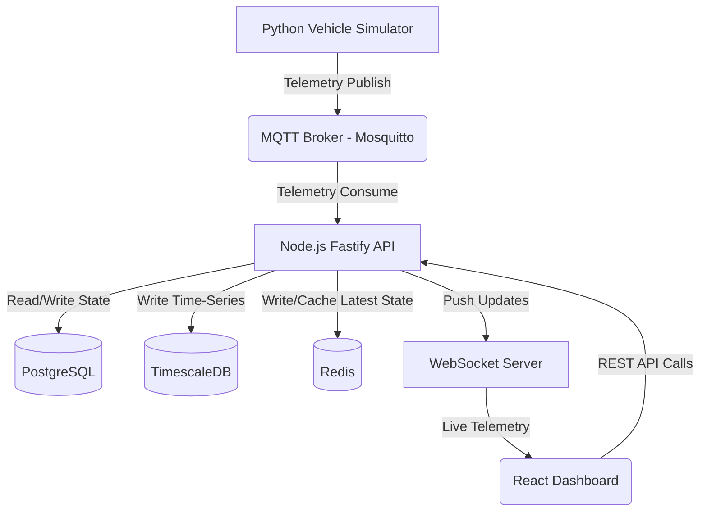

# System Overview

The FleetPulse system is built on a loosely-coupled, event-driven foundation.

## Core Components
- **Vehicle Simulator**: A Python script generating mock vehicle data and sending it to MQTT.
- **MQTT Broker**: Eclipse Mosquitto handling scalable telemetry ingestion.
- **Node.js Fastify API**: The central backend service. It consumes MQTT messages, validates them, saves historical data to TimescaleDB, updates live state in Redis, and pushes events to WebSockets. It also handles CRUD operations backed by PostgreSQL.
- **React Dashboard**: The user interface connecting to the API for configuration/historical data, and WebSockets for real-time live map updates.
